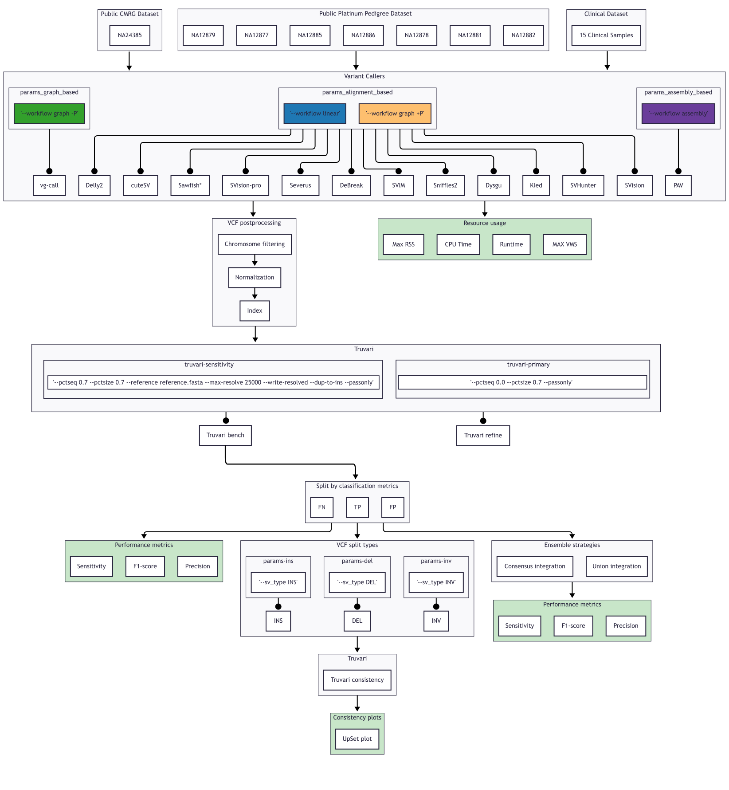

# Benchmarking long-read germline structural variant callers for research and clinic using both linear and pangenome-graph references with a novel dataset

**Background**: Structural variant (SV) detection is central to genomic research and clinical diagnostics. Long-read sequencing enables improved breakpoint resolution, yet the impact of genome representation—linear reference versus pangenome graph—on downstream SV calling performance remains incompletely characterized. Current SV benchmarking is dominated by a small number of reused truth sets, which systematically limits the generalizability of performance estimates.

**Results**: We benchmarked four alignment strategies across fourteen read-based, assembly-based, and graph-native SV callers using seven PacBio HiFi and and seven ONT samples from a curated Platinum Pedigree SV benchmark and fifteen independently validated clinical PacBio-HiFi-based datasets. This truth set is recent and thus unseen by most callers.

Performance was assessed against curated variant resources to quantify sensitivity, precision, concordance, and SV class–specific detectability. SV detection was strongly method-dependent across all workflows. Linear-reference alignment consistently achieved the most robust and generalizable balance of sensitivity and precision, whereas graph alignment, followed by projection to linear coordinates, introduced a reproducible sensitivity reduction for most callers. This effect was most pronounced for duplications, inversions, and complex rearrangements, while deletions were robustly detected across workflows. Sawfish and DeBreak maintained a competitive SV-calling performance independent of alignment strategy on PacBio HiFi and ONT datasets, respectively. Under linear alignment, ensemble analyses showed that union strategies maximized sensitivity at the cost of precision, whereas consensus strategies, in contrast to expectation, achieved near-union sensitivity yet reduced precision, largely due to inconsistencies in SV annotation that impaired false discovery evaluation. Cross-caller analyses revealed a stable core of high-confidence variants alongside substantial caller-specific contributions, indicating that no single method captures the full SV landscape.

**Conclusion**: Graph-based alignment does not inherently improve SV detection when paired with linear-reference SV callers. The union ensemble DeBreak+Sawfish and the consensus ensemble DeBreak+Sawfish+Sniffles2 using linear-reference alignment on PacBio HiFi datasets were the best-performing combinations.



## Requirements
1. Install [Omnibenchmark](https://docs.omnibenchmark.org/latest/howto/#install-omnibenchmark) v0.5.0.
2. Install [Apptainer](https://github.com/apptainer/apptainer/blob/main/INSTALL.md) v1.4.1.
3. Clone this repository using `git clone git@github.com:cphgeno/OB_LONGREAD_GERMLINE_SV_CALLERS_BENCHMARK-main.git --recurse-submodules` in order to automatically clone the submodules that are necessary for running this benchmark.
4. Populate the input data repositories.

The benchmark expects the repositories OB_LONGREAD_GERMLINE_SV_CALLERS_BENCHMARK-data-input (PacBio HiFi) and OB_LONGREAD_GERMLINE_SV_CALLERS_BENCHMARK-data-input-ont (ONT) to contain an `input_data` directory with the required benchmarking datasets.

Both repositories must use the same directory structure. The only difference is that the PacBio repository should contain PacBio HiFi-derived files, while the ONT repository should contain ONT-derived files.

The expected structure is:

input_data/
├── assemblies/
├── bams_graph/
├── bams_linear/
├── gams/
├── truthsets/
├── GCA_000001405.15_GRCh38_no_alt_analysis_set_maskedGRC_exclusions.fasta
└── GCA_000001405.15_GRCh38_no_alt_analysis_set_maskedGRC_exclusions.fasta.fai

For example, the PacBio repository should contain PacBio HiFi-based assemblies, alignments, and intermediate files within these directories, while the ONT repository should contain the corresponding ONT-based files.

The reference genome FASTA and its index (.fai) must be present in the root of the `input_data` directory.

**Note**: The files and directories inside `input_data` may be symbolic links rather than physical copies of the data. This can be useful when the datasets are stored elsewhere on the filesystem. When running the benchmark with Apptainer/Singularity, make sure that any directories referenced by symbolic links are included in the paths passed to `--singularity-args "--bind ..."` (as indicated below). Otherwise, the containers will not be able to access the linked files and the workflow may fail.

## How to run
Once the requirements above are satisfied, go to the folder where the repository has been cloned. Then, the following commands can be used to run the workflow for PacBio HiFi and ONT data, respectively:

```sh
# PacBio HiFi
ob run benchmark_truthset_pacbio.yaml \
 --rerun-triggers input mtime \
 --out-dir pacbio_results \
 --dirty \
 --singularity-args \
 "--bind /paths/to/bind"
 --workflow-profile /path/to/workflow-profile

# ONT
ob run benchmark_truthset_ont.yaml \
 --rerun-triggers input mtime \
 --out-dir ont_results \
 --dirty \
 --singularity-args \
 "--bind /paths/to/bind"
 --workflow-profile /path/to/workflow-profile
```

This commands will start a snakemake workflow (one for each dataset) that will produce the benchmarking results under the folders `pacbio_results` and `ont_results`.

## Workflow configuration

The workflow definitions are contained in `benchmark_truthset_pacbio.yaml` and `benchmark_truthset_ont.yaml`. These files define the repositories, container images, variant-calling workflows, and benchmarking stages used during execution.

### Repository versions

Each workflow stage references a repository containing the code required to execute that stage. The example commands above use the `--dirty` flag, which instructs Omnibenchmark to use the local copies of the repositories present in the `repos/` directory rather than checking out specific commits defined in the workflow file.

This is particularly useful when modifying workflow repositories locally or when the data-input repositories contain symbolic links rather than physical copies of the underlying data.

### Container images

Workflow stages are executed within Apptainer/Singularity containers. The corresponding container images are stored in an ORAS-compatible registry.

### Variant-calling workflows

Each variant caller stage specifies a workflow type through the `--workflow` parameter. This determines which input files are used from the `input_data` repository as input to each variant caller.

For example:

```yaml
parameters:
  - values: ["--workflow", "linear"]
```

Available workflow types are:

| Workflow | Input data |
|-----------|------------|
| `linear` | Linear-reference alignments from `bams_linear/` |
| `graph` | Graph-derived alignments stored as BAM files in `bams_graph/` |
| `gam` | Native graph alignments from `gams/` |
| `assemblies` | Genome assemblies from `assemblies/` |

The appropriate workflow depends on the requirements of the variant caller being benchmarked.

### Post-processing

The raw VCF produced by each variant caller undergoes a post-processing stage before benchmarking.

This stage performs normalization and filtering to ensure that all callers are evaluated on a comparable set of variants. In particular:

- Variants are normalized to a consistent representation.
- Chromosomes not present in the benchmark truth set are removed.
- The resulting VCF contains only chromosomes represented in the truth set.

The post-processed VCF files are subsequently used as input for the `truvari bench` and `truvari refine` benchmarking stages.

## Data availablity
To facilitate reproducibility and enable further benchmarking studies, we have made post-processed VCF files for each variant caller, workflow, and sequencing data type publicly available at: https://doi.org/10.5281/zenodo.20608006.

